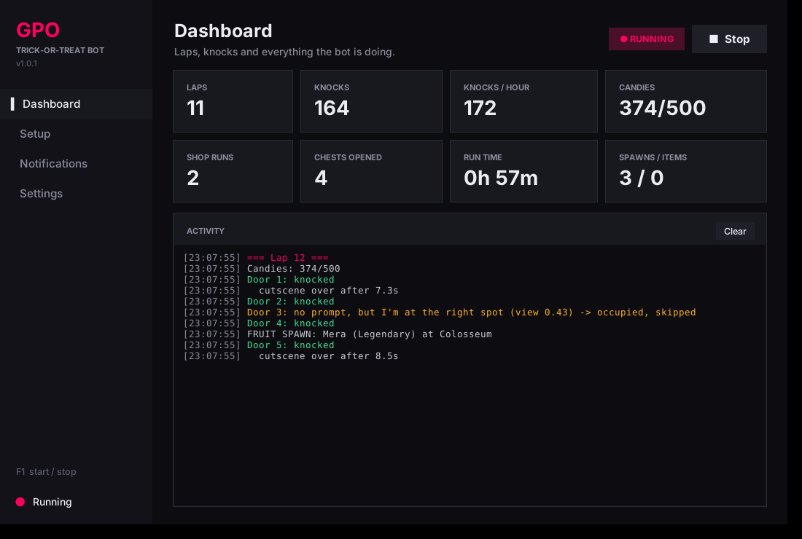
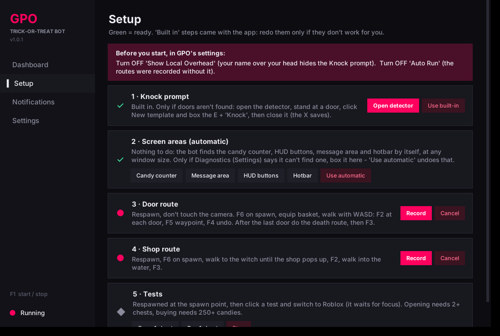
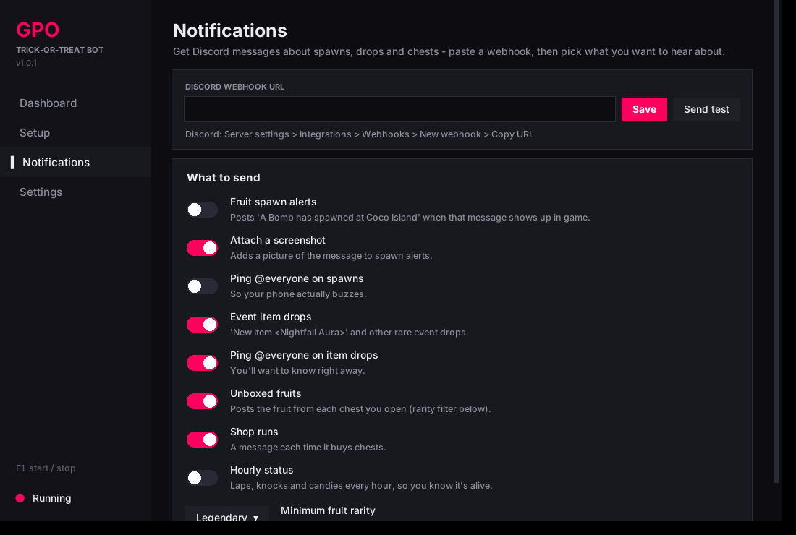
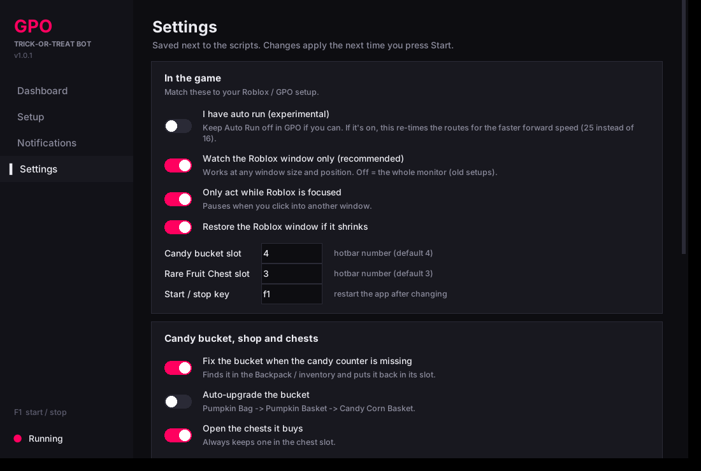

# GPO Trick-or-Treat Bot

A desktop app that plays the **Grand Piece Online Halloween trick-or-treat event** for you: it walks a route
you record, knocks on every door, buys and opens Rare Fruit Chests, stores the fruits, keeps your candy
bucket equipped and upgraded, and pings you on Discord when something good happens.

It works by **looking at the screen and pressing keys / moving the mouse**, the same way you would. It does not
read or change the game's memory or files.



> **Use at your own risk.** Automating gameplay may be against the game's rules. The game's staff decide what
> is allowed, not this project. You are responsible for your own accounts.
>
> This is a fan-made tool. It is **not affiliated with or endorsed by** Grand Piece Online, its developers, or
> Roblox Corporation. Game names belong to their owners.

---

## Features

- **Door route:** walks your recorded route and knocks on every door (checks it's actually moving, and gets
  back on track if it isn't).
- **Candy counter:** reads your candies and goes shopping when you have enough.
- **Shop:** walks to the witch and buys **Rare Fruit Chests** or **Race Rerolls** (your choice in Settings), plus
  bucket upgrades, then gets back.
- **Chests:** opens them, reads what you got, and stores the fruits (when buying chests).
- **Candy bucket:** keeps it in its slot, re-equips it after respawning, and upgrades it
  (Pumpkin Bag → Pumpkin Basket → Candy Corn Basket).
- **Death and respawn detection:** uses the HUD buttons, with retries.
- **Discord notifications:** fruit spawns, rare items, chest results, errors. You can filter by rarity.
- **No setup:** it finds the candy counter, HUD, messages and hotbar on its own, at any window size, on any
  monitor. The knock prompt and routes come built in.
- **Diagnostics:** one click shows what the bot sees and what needs fixing.
- **Keeps your settings** in `%APPDATA%\GPOTrickBot`, so updating the exe doesn't wipe your setup.

| Setup | Notifications | Settings |
|---|---|---|
|  |  |  |

---

## Download

1. Go to **[Releases](../../releases)** and download `GPOTrickBot.exe`. You don't need to install Python.
2. Put it anywhere and run it.

**Windows SmartScreen / antivirus:** the exe isn't code-signed, so Windows may say *"Windows protected your PC"*.
Click **More info → Run anyway**. Some antivirus programs flag apps that simulate key presses. If yours does,
build it yourself from the source (see [Building from source](#building-from-source)).

> Some games ignore key presses from a program unless it runs **as administrator**. If nothing happens in
> Roblox when the bot presses keys, right-click the exe and choose **Run as administrator**.

---

## Before you start (in Roblox)

### GPO settings (important)
In GPO's in-game settings:

| Setting | Set it to | Why |
|---|---|---|
| **Show Local Overhead** | **Off** | Your own name, title and health bar float over your character, right where the **E Knock** prompt appears. Turning it off keeps the prompt clean, so doors aren't missed. |
| **Auto Run** | **Off** (recommended) | The built-in routes were recorded without auto run. With it on you walk forward faster (25 instead of 16) and overshoot. The app's **I have auto run** setting can re-time the routes for it, but that's **experimental**. |

### Roblox

- **Any resolution works**, but don't make the window tiny. At least about **1280×720** is best.
- **Hotbar:** put your **candy bucket in slot 4** and a **Rare Fruit Chest in slot 3**. You can change both in
  Settings.
- Respawn at the event's spawn point and **don't move the camera**. The route is a list of keys played back,
  so the camera must face the same way every time you respawn.
- Keyboard layout doesn't matter. Keys are replayed by physical position, so AZERTY is fine.
- **Auto run:** keep it off in GPO. If you really want it on, also turn on **Settings → I have auto run
  (experimental)** so the routes are re-timed. That isn't fully tested yet.

You don't have to tell the bot where anything is. It finds the candy counter, the Menu / Backpack / Party /
Daily Quests buttons, the message area under the SAFE ZONE banner, and your hotbar (even as it grows and
shrinks) **by itself, at any window size**.

---

## Quick start

1. Set the GPO settings above (Show Local Overhead off, Auto Run off). Open the app, put Roblox at the spawn point, and hold your candy bucket.
2. **Settings → Diagnostics.** Everything should say **OK**. If a line says **FIX**, it tells you what to do.
3. Click **Start** (or press **F1** in Roblox).

The release comes with the knock prompt and the door and shop routes **built in**. The **Setup** page shows
them as *Built in*. Only redo a step there if it doesn't work for you (see below).

---

## Setup page (only if something doesn't work)

### 1 · Knock prompt
If doors aren't found: click **Open detector**. Stand at a door so the **E Knock** prompt is showing, click
**New template** and draw a box around the **E + "Knock"**. Close the window (the X saves).

### 2 · Screen areas (automatic)
Nothing to do. If Diagnostics says it can't find one of them (for example, the hotbar on a very dark night),
you can box it yourself here. **Use automatic** undoes that.

### 3 · Door route
To record your own: respawn and don't touch the camera. Click **Record**, switch to Roblox, then:

| Key | What it does |
|---|---|
| **F6** | Start (standing on the spawn point). Then equip the basket. |
| **F2** | You're at a door: mark it. |
| **F5** | Mark a waypoint (a turn where it should check its position). |
| **F4** | Undo the last mark. |
| **F3** | Finish and save. |

Walk with **W A S D**. After the last door, do the **death route** (for example, walk into the water), then press **F3**.
Let go of the movement keys before pressing F2 / F5 / F3.

### 4 · Shop route
To record your own: respawn, click **Record**, press **F6** on the spawn point, walk to the witch until the shop
pops up, press **F2**, walk into the water, press **F3**.

### 5 · Tests
Respawn at the spawn point, click a test, switch to Roblox (it waits until Roblox is focused):
- **Open 1 chest** needs 2+ chests (it always keeps one in the slot).
- **Buy 1 chest** needs 250+ candies.

---

## Running

- Click **Start** on the Dashboard or press **F1** in game. **F1 again stops it.**
- When you start again it asks whether to **continue** where it stopped or **restart** the lap.
- The Dashboard shows doors knocked, candies, chests bought and opened, fruits, and a live log.
  Everything is also written to `%APPDATA%\GPOTrickBot\log.txt`.

### Discord notifications
On the **Notifications** page, paste a **webhook URL** (Discord: *Server settings → Integrations → Webhooks →
New webhook → Copy URL*). Then choose what to be told about and the minimum fruit rarity. Click **Test**.

---

## Troubleshooting

**Start with Settings → Diagnostics.** It takes a screenshot, runs every detector on it, and shows:
- a picture with what the bot is looking at (boxes, hotbar slots), and
- a list of **OK / FIX** lines that say exactly what's wrong.

| Problem | Fix |
|---|---|
| "Looking at: monitor …" instead of "Roblox window" | Roblox must be open (not minimized). Turn on *Look at the Roblox window only* in Settings. |
| Candy counter not found | Hold the candy bucket so `123/500 Candies` shows, then run Diagnostics again. |
| HUD buttons not found | Be alive, with nothing covering the Menu / Backpack buttons. |
| Hotbar not found | Very dark scenes can hide it. Box it once (Setup → 2 → Hotbar). |
| Doesn't find doors | Turn off **Show Local Overhead** in GPO's settings. Still missing? Setup → 1 → **Use built-in**. |
| Walks too far / not far enough | Turn **Auto Run off** in GPO (and **I have auto run** off in the app). |
| Walks off the route | The camera was moved. Respawn without touching it. Still wrong? Re-record the route (Setup → 3). |
| Keys do nothing in Roblox | Run the exe as administrator. |

**Still stuck?** Click **Settings → Support bundle**. It makes a zip with your settings, recent log, and the
diagnostics picture (your **Discord webhook is removed**). Attach it to a GitHub issue.

---

## Multiple accounts / RDP

- You can run one copy per Windows session (for example, one per RDP session), each with its own Roblox.
- RDP windows must stay **open and not minimized**. Windows stops drawing a minimized RDP session, so the bot sees nothing.
- Window sizes can differ between sessions: everything is measured relative to each Roblox window.

---

## Building from source

Needs **Windows** and **Python 3.11+**.

```bat
git clone https://github.com/<you>/gpo-trick-bot
cd gpo-trick-bot
pip install -r requirements.txt
python gpo_bot_app.py          REM run from source
build_exe.bat public           REM build dist\GPOTrickBot.exe (without your webhook)
```

`build_exe.bat` with no argument bakes **your whole setup (webhook included)** into the exe, which is handy for your
own alts. Don't share that one. Pushing a `v*` tag builds the public exe on GitHub Actions with the shared setup
in [`defaults/`](defaults/) (no webhook, no screen boxes) and attaches it to a Release.

| File | What it is |
|---|---|
| `gpo_bot_app.py` | The app (UI) |
| `knock_bot.py` | The bot: routes, shop, chests, bucket, diagnostics |
| `find_knock_gui.py` | Knock-prompt detector + data folder |
| `text_reader.py` | Text reading (OCR) and parsing |
| `notify.py` | Discord webhooks + message watcher |
| `screen.py` | Finds the Roblox window; everything is relative to it |
| `prepare_seed.py` | Packs the default setup into the exe |
| `knock_default.png` | Built-in E + Knock prompt (verified by reading "Knock") |

---

## License

[MIT](LICENSE)
